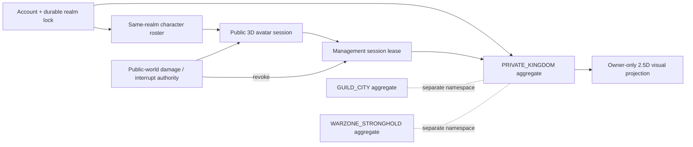

# Private Kingdom Save and State Synchronization Architecture

**Status:** Owner-decided coordination contract; production implementation held

**Decision date:** 2026-08-14

**Primary mode:** Codex coordination/review

**Parent:** [#461](https://github.com/yulee94/AnotherLife/issues/461)

**Related contracts:** `Cross_Mode_Menu_Kingdom_Navigation_Contract.md`,
`Save_Semantic_Compatibility_Policy.md`,
`Save_Profile_Identity_And_Write_Authority_Spec.md`,
`Architecture/Kingdom_Building_Level_And_Placement_Design.md`, and
`Architecture/Live_Kingdom_Construction_UX_Design.md`

## Authority and evidence binding

This contract records the user's finalized Private Kingdom decisions from the
active A1 conversation. It is reconciled against the retained planning errata
`FIRST_USER_EXPERIENCE_REPLACEMENT_SYSTEM_v003_KINGDOM_ERRATA_v001.md`
(6,318 bytes; SHA-256
`ae848bd1e19b34e5bcca4bb80bf8efe0952ffae7c9934b8ab817f34ab380e7c2`).
That errata is byte-bound to
`FIRST_USER_EXPERIENCE_REPLACEMENT_SYSTEM_v003.md` (39,965 bytes; SHA-256
`60384499eadb3be58326f6829c05191dc663f59349945acfff089473af0f5e3e`).

The retained visualization files are evidence, not repository source and not
runtime, visual, production, or release approval. This repository contract is
the reviewable architecture handoff. Where older private-kingdom drafts or the
unmerged single-file navigation draft in PR #485 conflict, this contract and
the linked reconciled navigation contract supersede them. PR #485 is not an
implementation dependency and must not be merged in parallel.

## 1. Outcome

AnotherLife has three separate kingdom-like namespaces:

1. `PRIVATE_KINGDOM` — an account-owned, owner-only 2.5D management
   simulation shared by the account's same-realm characters;
2. `GUILD_CITY` — shared guild/city state governed by its own membership,
   season, permission, and ownership contracts; and
3. `WARZONE_STRONGHOLD` — public contested 3D warzone state governed by its own
   siege, collision, destruction, capture, and ownership contracts.

They do not share aggregates, building rows, coordinates, revisions, queues,
or authority. A type called `Building`, a visually similar asset, or a common
definition ID never permits state to cross namespaces.

The private kingdom is an isolated virtual world. It is not co-rendered with,
placed into, or simultaneously controllable from 3D Character Mode. The
player's public-world avatar remains server-simulated and vulnerable while the
player manages the private kingdom, but the avatar is only an interruption
anchor. A qualifying public-world interruption revokes the management session
and immediately returns the client to 3D control.

Consequently, the earlier proposed private-building “dual representation” is
rejected. A private building has:

- authoritative 2.5D management state;
- a catalog-resolved 2.5D visual projection, which may use detailed 3D models;
- no public-world transform;
- no public-world physics or collision bounds;
- no public-world destructible structural hit points; and
- no visitor, enemy-player, or enemy-NPC occupancy.

Guild City and Warzone Stronghold may later own physical 3D entities, but only
inside their separate contracts and storage namespaces.

## 2. Owner decisions now binding

| Area | Binding decision |
| --- | --- |
| Entry and exit | Shared Menu is the only top-level 3D ↔ private-kingdom route. |
| `B` input | Keyboard `B` opens the construction dock only after Kingdom Mode is active. Controller `B` remains Back. |
| Ownership | One private kingdom belongs to one account and is shared by that account's same-realm characters. |
| Visibility | Owner-only. No visitors, enemy players, or enemy NPCs. |
| World model | Isolated 2.5D virtual management simulation; never a coexisting 3D control space. |
| Public avatar | Remains in the public world, server-simulated and vulnerable. A qualifying interruption immediately exits management. |
| Placement | Bounded cell grid inside unlocked territory replaces fixed plots for the private namespace. |
| Instance identity | Confirmation mints one permanent `buildingInstanceId`; it is never changed or reused, including after any future relocation. |
| Growth | Castle/milestone progression expands territory. Castle Level 10 is the permanent maximum. |
| Construction concurrency | Capacity starts at one active queue and may grow to an absolute maximum of three. |
| Workers | Citizens, construction workers, guards, and stonemasons are presentation-only miniatures; they do not change time, capacity, cost, or output. |
| Rush | No paid/premium-currency rush. A separately priced rush may spend only authoritative Oathmarks, the earned 3D main currency. |
| First placement scope | Pre-placement rotation and active-construction cancellation are approved. Completed-building relocation and demolition remain gated. |
| HUD | Bottom-center construction dock is canonical. Right side is the selected-building inspector. A radial wheel may be a temporary controller shortcut only. |
| Transition HUD | Both HUD families may appear only during the short transition. After Kingdom Mode settles, combat HUD collapses and only essential shared status remains. |
| Clear viewport | At least 60% clear viewport during normal navigation and placement on every device; deliberate full-detail panels and modals are the only temporary exceptions. |
| Authority | Production is server-authoritative. A nontransferable local development sandbox is a different authority and namespace. |

## 3. Prior collisions closed

This document supersedes the following private-kingdom assumptions in older
design drafts. It does not rewrite Guild City or Warzone Stronghold policy.

| Prior assumption | Resolution |
| --- | --- |
| Fixed stable plots are the placement authority | Replaced for `PRIVATE_KINGDOM` by unlocked, bounded cells and transactional footprint occupancy. |
| Every management building also exists as a public 3D entity | Rejected for `PRIVATE_KINGDOM`; there is no public-world building projection. |
| Player/enemy overlap must be resolved during placement | Eliminated by namespace separation; public actors have no private-grid coordinates. |
| Worker allocation changes construction duration | Rejected. Worker miniatures are visual only; the worker-allocation slider must not appear. |
| Construction queues are held | Superseded: capacity 1 initially, bounded to 3 later. |
| Cancellation is held | Superseded: active construction cancellation is an approved command, subject to a versioned refund policy. |
| Rotation is held | Superseded for pre-placement rotation. Completed-building rotation/relocation remains gated. |
| All speedups are held | Superseded only for an authoritative Oathmark rush. Paid/premium currency remains forbidden. |
| A direct HUD mode toggle is allowed | Rejected. Shared Menu remains canonical; the construction dock is not a mode switch. |
| Combat HUD remains beside the full Kingdom HUD | Rejected after the transition settles. |

## 4. System boundary



The durable private-kingdom aggregate owns logical state. The visual projection
is disposable and reconstructs from an immutable snapshot plus ordered deltas.
The public avatar service remains the authority for position, health, combat,
death, crowd control, forced movement, and interruption. The management lease
is the only bridge between them.

### 4.1 Forbidden coupling

- Private cell coordinates cannot be converted into public-world coordinates.
- A public avatar or enemy ID cannot be stored in a private occupancy cell.
- A private building cannot be selected by a public-world attack, siege,
  collision, destruction, or capture command.
- Guild/stronghold ownership cannot grant access to another account's private
  kingdom.
- Reusing the same art prefab does not imply shared gameplay identity.
- Client scene state, model visibility, animation completion, worker arrival,
  radial progress, or scaffolding state cannot advance authoritative progress.

## 5. Durable identity and database model

### 5.1 Aggregate identity

The canonical private kingdom key is:

```text
namespace = PRIVATE_KINGDOM
+ accountId
+ durable account realmId
-> privateKingdomId
```

`privateKingdomId`, `buildingInstanceId`, and `constructionOrderId` are opaque
server-issued identities. `operationId` is exactly 16 client-generated CSPRNG
bytes encoded as 32 lowercase hexadecimal characters, created once before the
first submission and reused unchanged for every retry. None of these identities
may encode a coordinate, character, device, timestamp, level, or asset path.

One account/realm pair has at most one live private kingdom. Same-realm
characters query the same `privateKingdomId`; character deletion, rename,
class change, or logout does not transfer or duplicate it. The account's realm
lock prevents a character from another realm entering the aggregate.

### 5.2 Recommended normalized tables

| Table | Primary/unique keys | Authoritative contents |
| --- | --- | --- |
| `private_kingdom` | PK `private_kingdom_id`; unique (`account_id`, `realm_id`) | aggregate revision, castle level, milestone revision, territory policy, queue capacity, catalog/policy revisions |
| `private_kingdom_cell` | PK (`private_kingdom_id`, `cell_id`) | unlock state, immutable local coordinate, terrain/placement class |
| `private_kingdom_occupancy` | PK (`private_kingdom_id`, `cell_id`); FK building | one-cell-to-one-building occupancy constraint |
| `private_kingdom_building` | PK `building_instance_id`; FK kingdom | definition, confirmed level, lifecycle, placement anchor, rotation index, row revision |
| `private_kingdom_construction_order` | PK `construction_order_id`; unique live order per building | target level, start/deadline, status, economy policy, accepted cost, cancellation/rush/completion receipt references |
| `management_authority_fence` | PK `public_avatar_session_id`; unique active `management_session_id` | account/realm/kingdom binding, monotonic `interrupt_generation`, monotonic `avatar_authority_generation`, lease state, row revision, expiry, last committed interruption event ID |
| `management_authority_fence_log` | PK (`public_avatar_session_id`, `fence_revision`) | immutable prior/new generations, state transition, qualifying combat/session event ID, operation ID when applicable, decision timestamp and digest |
| `private_kingdom_operation` | PK (`private_kingdom_id`, `operation_id`) | immutable request bytes/digest, command kind, decision class, committed revision, exact receipt bytes/digest, reconciliation state and retention tier |
| `private_kingdom_operation_tombstone` | PK (`private_kingdom_id`, `operation_id`) | permanent request digest and terminal-decision digest after online receipt compaction; prevents ID reuse |
| `private_kingdom_outbox` | PK `event_id`; unique operation/event kind | transactional domain events awaiting delivery |
| `private_kingdom_building_tombstone` | PK `building_instance_id` | terminal cancellation/demolition identity; prevents reuse |

`GUILD_CITY` and `WARZONE_STRONGHOLD` use different tables or mandatory
namespace-partitioned storage with independent constraints. They never use a
nullable namespace field that can be omitted.

### 5.3 Catalog references, not per-instance asset ownership

A building row stores stable `buildingDefinitionId`, `definitionRevision`, and
`presentationProfileId`. The client resolves scaffolding, in-progress modules,
completed meshes, LODs, materials, and quality-tier variants from a signed,
versioned catalog. Raw file paths, high-polygon mesh IDs, collider bounds, and
render-node hierarchy do not belong in the durable player row.

For the private namespace, physics bounds and structural hit points are absent
by contract. A schema or handler that receives them must reject the payload;
it must not preserve them as tolerated extras.

## 6. Unified private-kingdom JSON schema

The following Draft 2020-12 schema is the canonical snapshot envelope. It is
closed at every authoritative object. Presentation-only citizens and workers
are reconstructed from `presentationSeed` and are not gameplay resources.

```json
{
  "$schema": "https://json-schema.org/draft/2020-12/schema",
  "$id": "https://anotherlife.invalid/schema/private-kingdom-snapshot-v1.json",
  "title": "PrivateKingdomSnapshotV1",
  "type": "object",
  "additionalProperties": false,
  "required": [
    "schemaVersion",
    "namespace",
    "privateKingdomId",
    "accountId",
    "realmId",
    "aggregateRevision",
    "policy",
    "castle",
    "territory",
    "constructionQueues",
    "buildings",
    "presentation"
  ],
  "properties": {
    "schemaVersion": { "const": 1 },
    "namespace": { "const": "PRIVATE_KINGDOM" },
    "privateKingdomId": { "$ref": "#/$defs/opaqueId" },
    "accountId": { "$ref": "#/$defs/opaqueId" },
    "realmId": { "type": "string", "minLength": 1, "maxLength": 64 },
    "aggregateRevision": {
      "type": "integer",
      "minimum": 1,
      "maximum": 9223372036854775807
    },
    "policy": {
      "type": "object",
      "additionalProperties": false,
      "required": [
        "definitionCatalogRevision",
        "territoryPolicyId",
        "constructionPolicyId",
        "economyPolicyRevision"
      ],
      "properties": {
        "definitionCatalogRevision": { "$ref": "#/$defs/revision" },
        "territoryPolicyId": { "$ref": "#/$defs/opaqueId" },
        "constructionPolicyId": { "$ref": "#/$defs/opaqueId" },
        "economyPolicyRevision": { "$ref": "#/$defs/revision" }
      }
    },
    "castle": {
      "type": "object",
      "additionalProperties": false,
      "required": ["buildingInstanceId", "level", "milestoneId"],
      "properties": {
        "buildingInstanceId": { "$ref": "#/$defs/opaqueId" },
        "level": { "type": "integer", "minimum": 1, "maximum": 10 },
        "milestoneId": { "$ref": "#/$defs/opaqueId" }
      }
    },
    "territory": {
      "type": "object",
      "additionalProperties": false,
      "required": ["gridRevision", "unlockedCellIds", "maximumCellCount"],
      "properties": {
        "gridRevision": { "$ref": "#/$defs/revision" },
        "unlockedCellIds": {
          "type": "array",
          "uniqueItems": true,
          "maxItems": 16384,
          "items": { "$ref": "#/$defs/cellId" }
        },
        "maximumCellCount": {
          "type": "integer",
          "minimum": 1,
          "maximum": 16384
        }
      }
    },
    "constructionQueues": {
      "type": "object",
      "additionalProperties": false,
      "required": ["capacity", "activeOrderIds"],
      "properties": {
        "capacity": { "type": "integer", "minimum": 1, "maximum": 3 },
        "activeOrderIds": {
          "type": "array",
          "uniqueItems": true,
          "maxItems": 3,
          "items": { "$ref": "#/$defs/opaqueId" }
        }
      }
    },
    "buildings": {
      "type": "array",
      "maxItems": 4096,
      "items": { "$ref": "#/$defs/building" }
    },
    "presentation": {
      "type": "object",
      "additionalProperties": false,
      "required": ["presentationSeed", "worldBinding"],
      "properties": {
        "presentationSeed": {
          "type": "integer",
          "minimum": 0,
          "maximum": 2147483647
        },
        "worldBinding": { "const": "PRIVATE_VIRTUAL_ONLY" }
      }
    }
  },
  "$defs": {
    "opaqueId": {
      "type": "string",
      "minLength": 8,
      "maxLength": 128,
      "pattern": "^[A-Za-z0-9._:-]+$"
    },
    "operationId": {
      "type": "string",
      "minLength": 32,
      "maxLength": 32,
      "pattern": "^[0-9a-f]{32}$"
    },
    "revision": {
      "type": "string",
      "minLength": 1,
      "maxLength": 128
    },
    "cellId": {
      "type": "string",
      "minLength": 1,
      "maxLength": 64,
      "pattern": "^[A-Za-z0-9._:-]+$"
    },
    "placement": {
      "type": "object",
      "additionalProperties": false,
      "required": [
        "anchorCellId",
        "occupiedCellIds",
        "rotationIndex",
        "placementRuleRevision"
      ],
      "properties": {
        "anchorCellId": { "$ref": "#/$defs/cellId" },
        "occupiedCellIds": {
          "type": "array",
          "minItems": 1,
          "maxItems": 256,
          "uniqueItems": true,
          "items": { "$ref": "#/$defs/cellId" }
        },
        "rotationIndex": { "type": "integer", "minimum": 0, "maximum": 15 },
        "placementRuleRevision": { "$ref": "#/$defs/revision" }
      }
    },
    "constructionOrder": {
      "type": "object",
      "additionalProperties": false,
      "required": [
        "constructionOrderId",
        "operationId",
        "kind",
        "status",
        "targetLevel",
        "acceptedAtServerUtc",
        "completesAtServerUtc",
        "acceptedCost",
        "refundPolicyId",
        "rushPolicyId"
      ],
      "properties": {
        "constructionOrderId": { "$ref": "#/$defs/opaqueId" },
        "operationId": { "$ref": "#/$defs/operationId" },
        "kind": { "enum": ["NEW_BUILD", "UPGRADE"] },
        "status": {
          "enum": [
            "ACTIVE",
            "CANCEL_PENDING",
            "COMPLETION_PENDING",
            "COMMIT_UNCERTAIN"
          ]
        },
        "targetLevel": { "type": "integer", "minimum": 1, "maximum": 10 },
        "acceptedAtServerUtc": {
          "type": "string",
          "format": "date-time",
          "maxLength": 35
        },
        "completesAtServerUtc": {
          "type": "string",
          "format": "date-time",
          "maxLength": 35
        },
        "acceptedCost": {
          "type": "array",
          "maxItems": 32,
          "items": { "$ref": "#/$defs/cost" }
        },
        "refundPolicyId": { "$ref": "#/$defs/opaqueId" },
        "rushPolicyId": { "$ref": "#/$defs/opaqueId" }
      }
    },
    "cost": {
      "type": "object",
      "additionalProperties": false,
      "required": ["resourceId", "amount"],
      "properties": {
        "resourceId": { "$ref": "#/$defs/opaqueId" },
        "amount": {
          "type": "integer",
          "minimum": 0,
          "maximum": 9223372036854775807
        }
      }
    },
    "building": {
      "type": "object",
      "additionalProperties": false,
      "required": [
        "buildingInstanceId",
        "buildingDefinitionId",
        "definitionRevision",
        "rowRevision",
        "confirmedLevel",
        "lifecycleState",
        "placement",
        "presentationProfileId",
        "constructionOrder"
      ],
      "properties": {
        "buildingInstanceId": { "$ref": "#/$defs/opaqueId" },
        "buildingDefinitionId": { "$ref": "#/$defs/opaqueId" },
        "definitionRevision": { "$ref": "#/$defs/revision" },
        "rowRevision": {
          "type": "integer",
          "minimum": 1,
          "maximum": 9223372036854775807
        },
        "confirmedLevel": { "type": "integer", "minimum": 0, "maximum": 10 },
        "lifecycleState": {
          "enum": ["UNDER_CONSTRUCTION", "OPERATIONAL", "UPGRADING"]
        },
        "placement": { "$ref": "#/$defs/placement" },
        "presentationProfileId": { "$ref": "#/$defs/opaqueId" },
        "constructionOrder": {
          "oneOf": [
            { "type": "null" },
            { "$ref": "#/$defs/constructionOrder" }
          ]
        }
      }
    }
  }
}
```

The bounded maxima above are parser and denial-of-service ceilings, not product
balance. Before parsing, the UTF-8 snapshot is capped at exactly 2,097,152
bytes. Integers are parsed as checked signed 64-bit values; floating-point
coercion is forbidden. The validator must enable Draft 2020-12 `format`
assertion for `date-time` or perform an equivalent strict UTC/RFC 3339 check.
An accepted territory/building catalog must set substantially smaller
per-milestone values and may never exceed these hard bounds.

Cross-object validation additionally requires all of the following:

- building and order IDs are unique;
- `unlockedCellIds.length <= maximumCellCount`;
- every occupied cell exists in `unlockedCellIds`, no cell appears in more than
  one building, and each placement exactly equals the catalog-derived footprint
  for its definition, anchor, rotation, and placement-rule revision;
- the Castle ID resolves to the exact Castle building and the snapshot Castle
  level equals that row's confirmed level;
- the Castle level and `milestoneId` resolve under the exact territory and
  construction policies; `maximumCellCount`, the unlocked-cell set, building
  count cap, and queue capacity equal that accepted milestone (never merely a
  client-supplied value), and Level `10` cannot unlock a later milestone;
- `OPERATIONAL` requires a null construction order;
- `UNDER_CONSTRUCTION` requires confirmed level `0`, a non-null `NEW_BUILD`
  order, and target level `1`;
- `UPGRADING` requires a confirmed level from `1` through `9`, a non-null
  `UPGRADE` order, and a target level greater than the confirmed level and no
  greater than `10`;
- `activeOrderIds` is exactly the set of every non-null order whose status is
  one of the schema's live statuses; each resolves once, no other live order is
  omitted, and the live count does not exceed capacity;
- each accepted-cost array has unique resource IDs and checked nonnegative
  totals.

The owner's hero-card direction is presentation intent, not authority to copy
hero ownership into the kingdom aggregate. Owned hero cards may be queried into
a transient management read model only after a separate hero authority is
versioned; they are deliberately absent from the v1 kingdom snapshot.

JSON parsing alone is never acceptance.

## 7. Command and transaction semantics

### 7.1 Placement preview

Preview is client-side and disposable. It may show magnetic cell snapping,
valid/invalid tint, terrain projection, affected decoration, costs, and a
rotated footprint. It has no `buildingInstanceId` and reserves nothing.

The client sends a confirm command containing:

```text
operationId
privateKingdomId
expectedAggregateRevision
buildingDefinitionId + expected definition revision
anchorCellId
rotationIndex
client-observed occupiedCellIds
expected quote/price revision
managementSessionId
expectedInterruptGeneration
```

The server recomputes the footprint from definition, anchor, and rotation. It
never trusts the client's occupied-cell list, cost, duration, or validity tint.

Before the first network send, the production client atomically persists an
encrypted, account-scoped operation journal entry containing the operation ID,
command kind, canonical request bytes, request digest, and state `UNSENT`. It
then advances through `SENT`, `COMMIT_UNCERTAIN`, and `TERMINAL_RECEIPT_STORED`.
A crash, reconnect, or device handoff queries the same operation ID; it never
creates a replacement ID for an unresolved intent. The journal grants no
authority and cannot be imported into another account or the development
sandbox.

### 7.2 Confirm placement

Before mutable guards, the service authenticates the caller and stable
account/kingdom ownership, then looks up
`privateKingdomId + operationId`. If a durable operation exists and its request
digest is identical, the service returns the original stored result even when
the lease or aggregate revision has since changed. A different digest under the
same ID is a replay violation. Only an unseen ID proceeds.

The request digest profile is exact:

```text
prefix       = ASCII "AL_PK_COMMAND_V1\0"
kind         = u16le byteLength + uppercase ASCII command discriminator
payload      = u32le byteLength + RFC 8785 canonical JSON UTF-8 bytes
digest       = SHA-256(prefix || kind || payload), lowercase hexadecimal
```

The closed command schema rejects duplicate members and non-NFC strings before
canonicalization. Current identifiers/enums are ASCII; all integers are exact
bounded JSON integers; floats, exponent notation, negative zero, and non-finite
values are forbidden. Optional absent members are omitted; explicit `null` is
forbidden unless that exact command schema declares it. The payload contains
every semantic field, including the management session and expected interrupt
generation, and excludes transport headers, retry counters, and local
timestamps. These rules fix field order, framing, integer/string encoding,
Unicode handling, and null/absent behavior.

The operation row and its exact immutable receipt bytes are inserted in the
same transaction as the mutation, so no successful debit or occupancy change
can exist without a queryable idempotency result. Durable decisions are:

- `TERMINAL_ACCEPTED` or `TERMINAL_REJECTED`: replay of the same ID/digest
  returns the exact stored receipt forever, regardless of later mutable state;
- `COMMIT_UNCERTAIN`: freezes that intent and permits query/reconciliation only;
- `PRE_ADMISSION_TRANSIENT`: no durable decision exists because the request did
  not reach the fence; retry uses the same ID/digest.

Online exact receipt bytes remain queryable for 180 days after their terminal
decision. Compaction then retains an account-lifetime operation tombstone with
the operation ID, request digest, command kind, terminal decision/result code,
terminal digest, and referenced permanent building/order IDs. The tombstone is
never reusable; an archived exact receipt may be restored for audit, but its
absence cannot make the operation executable again.

One serializable database transaction then performs:

1. acquire the shared management-fence row used by both avatar interruptions
   and kingdom mutations;
2. require the exact active `managementSessionId`, public-avatar session, and
   `expectedInterruptGeneration` immediately before any debit or occupancy
   change;
3. compare `expectedAggregateRevision` with the current revision;
4. load the exact catalog and policy revisions;
5. recompute footprint and validate every cell is unlocked, placeable, and
   unoccupied;
6. validate building limits, prerequisites, and queue capacity;
7. validate and debit the authoritative kingdom resources;
8. mint one permanent `buildingInstanceId` and one construction order ID;
9. insert occupancy, building, order, operation receipt, and outbox event;
10. increment the aggregate revision; and
11. commit atomically at the management-fence linearization point.

The unique occupancy key prevents two concurrent placements from claiming the
same cell. Revision mismatch returns a fresh snapshot/delta requirement; it
never guesses which command should win.

### 7.3 Permanent building identity

- Preview and an unconfirmed blueprint have no durable building identity.
- A confirmed new build mints exactly one identity.
- Canceling new construction retires that identity into a tombstone; it is
  never reused for a later build.
- Canceling an upgrade keeps the existing building identity and confirmed
  level.
- A future approved relocation changes placement under the same identity.
- A future approved demolition retires the identity; it does not free it for
  reuse.

### 7.4 Construction timing

Timers are derived from server timestamps:

```text
remaining = max(0, completesAtServerUtc - trustedServerNow)
```

No one-second progress field is written. Worker animation, scaffolding stages,
particles, a radial gauge, app suspension, frame rate, local clock, and client
reconnect do not alter the deadline.

Queue capacity starts at `1`. A versioned milestone policy may increase it to
`2` and then `3`; values above `3` are invalid. Cosmetic workers do not consume
queue slots or modify deadlines.

### 7.5 Cancellation

An active order may be canceled only through an idempotent server command bound
to the exact management session and `expectedInterruptGeneration`. The
transaction uses the same management fence, locks/CAS-checks the order and
aggregate, rejects completed or terminal orders, applies the exact versioned
refund policy, releases the queue slot, updates occupancy as appropriate, emits
a receipt/outbox event, and increments the revision.

The exact refund amount is a balance input, not inferred here. Production must
fail closed if the order's accepted refund policy cannot be resolved.

### 7.6 Oathmark rush

Rush is not a paid-currency or client timer operation. It is a cross-domain
authoritative transaction against the single Oathmark wallet:

```text
expected kingdom revision
+ expected construction-order revision/deadline
+ expected Oathmark wallet revision
+ managementSessionId + expectedInterruptGeneration
+ versioned rush quote
+ idempotent operationId
-> one wallet debit
+ one terminal completed order result
+ one kingdom revision
+ one receipt/outbox publication
```

Kingdom activity does not mint Oathmarks. No premium token, platform purchase,
hidden conversion, local development balance, or kingdom resource may satisfy
the debit. If the wallet and kingdom cannot be committed under one trusted
transaction/coordinator, Rush remains unavailable rather than using a
best-effort saga that could debit without completing or complete without
debiting.

## 8. Perspective and session synchronization

### 8.1 Management lease

The server exposes an ephemeral `ManagementSessionLeaseV1` projection:

```json
{
  "managementSessionId": "opaque",
  "accountId": "opaque",
  "realmId": "ELDERGROVE",
  "publicAvatarSessionId": "opaque",
  "privateKingdomId": "opaque",
  "state": "ACTIVE",
  "kingdomRevision": 42,
  "publicAvatarCommandMode": "SERVER_SIMULATED_NO_PLAYER_MOVEMENT_INPUT",
  "interruptGeneration": 7,
  "expiresAtServerUtc": "2026-08-14T12:00:00Z"
}
```

It is not the ownership or fencing record. It is a TTL cache/read projection of
the durable `management_authority_fence` row and binds one authenticated client
session to one public avatar and one private kingdom for a short renewable
period.
Commands from an expired, revoked, wrong-avatar, wrong-account, or wrong-realm
lease are rejected even if their kingdom revision is otherwise current.

Every mutation carries the lease's exact `interruptGeneration`. The avatar
authority and private-kingdom service serialize interruption and mutation
through the durable fence row. Fence state is one of `INACTIVE`, `ENTERING`,
`ACTIVE`, `EXITING`, or `REVOKED`; `interrupt_generation`,
`avatar_authority_generation`, and `fence_revision` are checked signed 64-bit
monotonic integers. Every transition uses serializable row locking or an exact
revision CAS and appends the immutable fence-log record in the same commit.

A qualifying public combat/session event must commit its authoritative outcome,
the fence transition to `REVOKED`, and the incremented interrupt generation in
one database transaction. If avatar and kingdom data use separate stores, the
only permitted substitute is a consensus-backed transaction coordinator with a
durable prepare/commit decision log that both stores consult before exposing a
result. Kingdom placement/cancel/upgrade and cross-domain Oathmark Rush lock the
same fence decision before their own debit or occupancy mutation. Redis leases,
messages, clocks, and event delivery are cache/notification aids only and can
never decide the winner after process loss.

### 8.2 Entering private Kingdom Mode

```mermaid
sequenceDiagram
    participant C as "Client"
    participant M as "Shared-menu gateway"
    participant A as "Public avatar authority"
    participant K as "Private kingdom service"
    participant S as "Streaming/presentation"
    C->>M: "Request private Kingdom Mode"
    M->>A: "Validate avatar/session/entry guards"
    A->>K: "Create management lease"
    K-->>C: "Snapshot revision R + lease + catalog revisions"
    C->>S: "Prefetch data/assets; tear down instantiated 3D world"
    S-->>C: "3D world teardown verified"
    C->>S: "Instantiate isolated 2.5D projection"
    S-->>C: "Projection ready"
    C->>K: "Acknowledge revision R ready"
    K-->>C: "Lease ACTIVE"
    C->>C: "Collapse combat HUD; enable Kingdom input"
```

Exact client sequence:

1. The player chooses Kingdom Management in the Shared Menu.
2. The client freezes duplicate requests and sends a request bound to the
   authenticated avatar session and last observed public-avatar revision.
3. The server rejects entry if the avatar/session is already dead, changing
   worlds, disconnected, or under an active qualifying interruption.
4. The server creates the management lease while retaining public-avatar
   simulation and vulnerability. It stops accepting player movement/combat
   input for that avatar under this client session.
5. The kingdom service returns a bounded snapshot, aggregate revision, signed
   catalog/policy revisions, and any ordered deltas after the client's cached
   revision.
6. The client may prefetch immutable data and asset bytes while the public world
   is active, then enters a neutral noninteractive transition surface, tears
   down every instantiated public-world scene root/camera/collider, and verifies
   that teardown before instantiating any private projection object. Loaded
   bytes and decoded caches may overlap; instantiated worlds may not.
7. During the brief neutral transition, both HUD families may crossfade. If an
   interruption arrives at any point, entry is aborted and 3D control wins.
8. After the exact kingdom revision and required visual assets are ready, the
   client acknowledges readiness; only then does Kingdom input activate.
9. The combat HUD collapses, leaving only essential shared status and the
   interruption/connection affordance.

### 8.3 Returning from 2.5D to 3D

The earlier “stream newly placed private buildings into 3D” sequence is
removed. Private buildings never instantiate in the public 3D world.

Exact return sequence:

1. The player chooses Return to Character Mode in the Shared Menu, or the
   server emits a forced management interruption.
2. The client immediately disables private placement/confirmation input and
   sends/acknowledges the exit generation. Unacknowledged local previews are
   discarded; accepted commands reconcile by `operationId`.
3. The server atomically marks the lease `EXITING`/`REVOKED`, rejects later
   kingdom commands from it, and returns the newest authoritative public-avatar
   snapshot: world/zone generation, transform, health, status, and command
   revision.
4. On a neutral noninteractive transition surface, the client destroys the
   complete instantiated private projection and verifies that no private world
   root, camera, collider, or input owner remains. Snapshot and immutable asset
   caches may remain bounded.
5. Only after that teardown proof may the client instantiate the cached public
   render set or priority-stream the required cell. It applies the server
   snapshot without interpolating from private
   grid coordinates, restores the 3D camera and input map, and acknowledges the
   public-avatar generation.
6. The server resumes 3D player commands only for that acknowledged generation.

This route may avoid a conventional loading screen when data/assets are warm,
but the neutral transition surface remains until teardown and destination
readiness are proven. The game never keeps both world instances resident and
never exposes an uncollided 3D actor.

### 8.4 Forced interruption

At minimum, committed positive damage, avatar death, session replacement,
forced world/zone transition, or loss of avatar authority revokes the lease.
Additional crowd-control or combat events must be explicitly typed by their
owning combat contract; presentation-only hit flashes cannot revoke or preserve
authority.

On revocation:

1. the server acquires the shared management fence, increments
   `interruptGeneration`, marks the lease revoked, and commits that fence before
   releasing it;
2. an ordered, reliable `ManagementInterrupted` event is sent;
3. the client preempts menus, placement, modals, and animation;
4. accepted operations reconcile by operation ID; unconfirmed previews vanish;
5. public-avatar snapshot restoration takes priority over all 2.5D work; and
6. the client returns to 3D with an accessible reason such as `Under attack`.

Ignoring or delaying the event cannot preserve exploit authority because the
server already revoked the lease.

The fence defines the race exactly: if a kingdom mutation commits first, that
result persists and the immediately following interruption exits management;
if interruption commits first, the mutation rejects atomically with no debit,
occupancy, timer, or revision change.

## 9. Placement validation and anti-exploit semantics

### 9.1 Namespace eliminates public-actor overlap

A private-grid command cannot target a public `(X,Y,Z)` position. It uses only
`privateKingdomId + cellId + rotationIndex`. Public players and enemies have no
private cell IDs; private citizens/workers/guards are cosmetic projections and
have no authoritative collision claim.

Therefore the server never displaces a public player to place a private
building. A payload containing public coordinates, player IDs, enemy IDs,
physics bounds, or a foreign namespace is rejected as a schema/authority
violation.

Cosmetic citizens may locally repath, fade, or respawn at a nearby visual
socket when a footprint is confirmed. That has no save, combat, pathfinding,
resource, or ownership effect.

### 9.2 Server placement pipeline

The server validates, in order:

1. syntactic bounds, authentication, stable account ownership, realm lock, and
   exact `PRIVATE_KINGDOM` namespace;
2. existing-operation lookup: identical digest returns the original receipt;
   different digest rejects; only an unseen operation continues;
3. acquire the shared management fence and recheck the exact lease,
   public-avatar session, and `expectedInterruptGeneration`;
4. aggregate, grid, definition, quote, and policy revisions;
5. building definition availability and allowed rotation;
6. server-recomputed footprint inside unlocked territory;
7. terrain/placement class, reserved access lanes, and forbidden cells;
8. occupancy unique constraints;
9. castle/milestone building limit and construction queue capacity;
10. resource/wallet authority and checked arithmetic;
11. durable transaction/outbox commit; and
12. immutable receipt publication.

Any failure returns a typed rejection without changing resources, cells,
building identity, timers, or revision. A commit-uncertain result freezes the
affected operation until reconciliation; the client cannot retry with a new ID
to bypass uncertainty.

### 9.3 Concurrency and locking

The database revision/CAS and unique cell constraints are durable authority.
A short Redis lease may reduce contention, but Redis/Redlock is never the sole
correctness boundary. Two simultaneous commands must still serialize or make
one fail its database revision/constraint check after failover.

Locks are scoped to the private aggregate and exact cross-domain wallet rows
needed by the command. Lock order is fixed and documented to prevent deadlock.
No namespace-wide global lock is used for ordinary placement.

## 10. Event-driven delta saves and Redis strategy

### 10.1 State classes

| State | Frequency | Redis role | Durable-write rule |
| --- | --- | --- | --- |
| Public avatar transform/velocity | high | short-lived session hash or in-memory authority with TTL mirror | checkpoint at zone handoff, logout, death/recovery, or bounded interval; never every frame |
| Public avatar health/combat authority | high/critical | authoritative server process plus ordered replication; Redis for failover/session routing | durable at critical outcome/checkpoint boundaries defined by combat/save contracts |
| Management lease | ephemeral | TTL hash bound to account/avatar/kingdom/generation | audit only if required; ownership never derives from lease |
| Private kingdom snapshot | read-heavy | immutable revision cache | durable DB remains authority |
| Placement/build/upgrade/cancel/rush | low/critical | idempotency and short serialization cache | one atomic DB transaction per accepted state shift |
| Timer countdown | derived | no per-second hash writes | persist accepted start/deadline and terminal completion only |
| Due construction | scheduled | Redis sorted set by deadline | claim triggers DB CAS transaction; sorted set is not completion authority |
| Cosmetic workers/citizens | frame-local | none, or client pool only | never durable gameplay state |

### 10.2 Suggested key families

```text
prod:avatar:session:{publicAvatarSessionId}
prod:avatar:route:{accountId}
prod:mgmt:lease:{managementSessionId}
prod:private-kingdom:snapshot:{privateKingdomId}:{revision}
prod:private-kingdom:head:{privateKingdomId}
prod:private-kingdom:op:{privateKingdomId}:{operationId}
prod:private-kingdom:due
prod:private-kingdom:delta:{privateKingdomId}

dev-sandbox:{installationId}:private-kingdom:...
```

Production and development prefixes, credentials, databases, signing keys,
and IDs are distinct. A development key can never be copied, imported, or
promoted into production.

### 10.3 Delta publication

Every accepted durable transaction writes an outbox event in the same database
commit. An outbox publisher emits ordered events containing:

```text
privateKingdomId
previousRevision
newRevision
operationId
eventId
eventKind
minimal changed entity IDs/fields
payload digest
catalog/policy revisions
```

Clients accept a delta only when `previousRevision` equals their current
revision. Duplicate `eventId` is ignored. A gap, reordering, unknown event,
digest failure, or catalog mismatch requests a new bounded snapshot; it never
applies a best-effort patch.

### 10.4 Due-order completion

On order acceptance, the service inserts the deadline into
`prod:private-kingdom:due`. One or more workers claim due IDs with a bounded
lease, then execute a DB transaction that rechecks order status, deadline,
policy, aggregate revision, and idempotent completion identity. The DB result
is authoritative. A lost Redis entry is recovered by a bounded DB scan/index;
a duplicated entry produces the same terminal receipt and no duplicate level.

### 10.5 Write-amplification limits

- Do not persist countdown seconds or progress-bar values.
- Coalesce avatar transform replication and separate it from kingdom writes.
- Do not rewrite the full kingdom blob for a cosmetic worker path or camera
  move.
- Cache immutable snapshot revisions rather than mutating one shared JSON blob.
- Bound delta retention by count and age; clients outside the window reload a
  snapshot.
- Batch presentation asset requests, not authoritative commands.
- Keep exact operation receipts long enough for retry/reconnect policy; do not
  evict them merely because a Redis TTL elapsed if the durable dedupe window
  remains active.

## 11. Client presentation and HUD binding

### 11.1 Screen zoning

- Top-left: compact kingdom overview such as population, safety, and tax only
  when those values have authority.
- Top-right: global kingdom resources.
- Left edge: current construction queue, bounded to the actual capacity.
- Bottom-center: canonical construction dock and category/building cards.
- Right edge: selected-building contextual inspector.
- Bottom-left: system/shared-menu affordance.
- Bottom-right: minimap only if it represents the private grid, not the public
  world map.
- Center: placement, scaffolding, in-world progress, and clear terrain view.

At least 60% of the safe-area screen remains unobstructed in normal navigation
and placement on PC, tablet, and phone. A deliberate detail panel/modal may
temporarily exceed that limit. Safe areas and 150–200% text scaling must not
push primary actions offscreen.

### 11.2 Construction interaction

- Opening the dock may smoothly widen the 2.5D camera, but cannot change
  public-avatar state.
- Blueprint snapping uses a crisp approximately 0.1-second presentation
  interpolation; the server still validates the exact target cell.
- Valid/invalid color is paired with text/icon/shape, never color alone.
- Confirmation creates scaffolding and a radial/linear progress projection
  only after an accepted server receipt.
- Progress bars derive from server start/deadline.
- Completion particles, screen shake, and scaffold removal are presentation;
  they occur only after the completed revision is observed.
- Screen shake is localized, reduced-motion aware, and omitted when the camera
  is not near the completed site.

### 11.3 Contextual inspector corrections

The right inspector may show countdown, authoritative progress, cancel, and
eligible instant-completion Oathmark Rush. It must not show worker-allocation sliders or imply
workers change duration. Destructive actions remain spatially separated and
use hold/confirm/accessibility-safe alternatives, but their server command is
still idempotent and revision-bound.

The bottom-center dock remains canonical. A controller radial wheel may invoke
the same dock commands as an input shortcut; it owns no separate selection,
quote, or confirmation state.

## 12. Local development sandbox

The local sandbox is explicitly nontransferable:

- uses a `DEVELOPMENT_SANDBOX` namespace, not `PRIVATE_KINGDOM`;
- uses synthetic installation-local identity, never production `accountId`;
- cannot authenticate to production command, wallet, or outbox services;
- cannot import/export production preset codes or operation receipts;
- cannot spend or grant production Oathmarks/resources;
- marks all UI and evidence as development;
- may accelerate clocks only inside the sandbox service; and
- is deleted/reset independently without affecting production.

An exported screenshot or local JSON is not a production save. No migration
path from sandbox state to production is provided.

## 13. Failure and recovery matrix

| Condition | Required behavior |
| --- | --- |
| Client disconnect while managing | Lease expires/revokes; public avatar remains under server authority; accepted kingdom operations reconcile by ID. |
| Damage during placement preview | Revoke lease, discard preview, restore 3D. No building ID or spend exists. |
| Damage after accepted placement | Building/order remains authoritative; revoke lease and return 3D. |
| Completion while in 3D/offline | DB completion occurs; next Kingdom snapshot renders completed settled state without replaying the full build. |
| Stale grid/aggregate revision | Reject command and request ordered deltas or a fresh snapshot. |
| Unknown operation result | Mark commit uncertain; query by operation ID; do not repeat spend/placement. |
| Missing presentation asset | Keep gameplay state, show explicit unavailable/low-tier projection; never substitute another building identity. |
| Redis loss | Rebuild caches/due schedule from DB/outbox; no gameplay rollback or invented completion. |
| DB unavailable | Reject new mutations; allow bounded read-only cached presentation only when clearly stale/unavailable. |
| Catalog/policy revision unavailable | Reject affected mutation; preserve confirmed state. |
| Foreign namespace payload | Reject and audit; never coerce to private. |

## 14. Required tests

### Identity and namespace

- one account/realm maps to exactly one private kingdom;
- every same-realm character resolves the same ID;
- wrong-realm, wrong-account, visitor, guild-city, and stronghold IDs fail;
- IDs remain stable through character rename/delete and future relocation;
- retired building IDs are never reused.

### Placement and concurrency

- every allowed rotation/footprint against borders, locked cells, reserved
  lanes, and terrain classes;
- client-forged occupied cells, costs, duration, and valid tint rejected;
- two concurrent overlaps yield one commit;
- two nonoverlapping placements at stale revision do not lose updates;
- identical operation-ID/digest replay returns the original result before
  mutable lease/revision guards, while a changed digest under that ID rejects;
- queue capacity exactly 1, later 2/3, never 4;
- Castle Level 10 cannot expand beyond its accepted permanent cap.

### Construction lifecycle

- start, offline completion, reconnect, duplicate completion, cancellation,
  cancel/complete race, and commit uncertainty;
- new-build cancellation tombstones identity and frees cells exactly once;
- upgrade cancellation preserves prior level and building identity;
- Oathmark Rush debits/completes exactly once, rejects stale wallet/order, and
  cannot use kingdom/premium/sandbox currency;
- cosmetic worker count/path has zero effect on timing and results.

### Mode synchronization

- Shared Menu is the only top-level route;
- keyboard/controller mappings do not bypass the route;
- no simultaneous controllable 3D and 2.5D modes;
- damage during entry, active management, modal, placement, confirmation, and
  exit always restores 3D and revokes old commands;
- a barrier-controlled damage-versus-placement race proves the shared fence in
  both orders: mutation-first persists then exits, interruption-first produces
  no debit, occupancy, timer, identity, or kingdom revision;
- public-avatar transform/health never derive from private grid state;
- warm-cache and cold/low-memory return both wait for collision and authority
  before control;
- combat HUD collapses after entry and returns after exit;
- 60% clear viewport at representative PC, tablet, phone, safe-area, and
  large-text fixtures.

### Redis/DB fault injection

- lost, duplicated, delayed, and reordered deltas;
- Redis restart/lost due entry;
- DB commit before/after outbox publication failure;
- lease expiration and session replacement;
- duplicated operation IDs with same and different request digests;
- server failover at every placement/cancel/rush/completion boundary;
- bounded snapshot/delta/parser size and malicious payload rejection.

## 15. Remaining authored inputs, not architecture collisions

The decisions above close the architecture collisions. These values still need
their owning balance/source contracts before production activation:

- exact cell dimensions and unlocked shape at each Castle/milestone level;
- exact per-level building-count limits and catalog footprints;
- exact queue-capacity unlock milestones for capacity 2 and 3;
- exact cancellation refund policies;
- exact Oathmark Rush eligibility and cost curve;
- exact construction costs/durations and prerequisite graph;
- exact authoritative interrupt event set beyond the minimum safety events;
- final building, scaffolding, citizen, worker, guard, and hero-card source;
- catalog delivery/Addressables or AssetBundle strategy and device budgets; and
- measured Windows/Android performance, memory, loading, package size, and
  integrated user playtest acceptance.

Until those inputs are versioned, the system may implement pure schemas,
validators, planners, deterministic serializers, and local sandbox fixtures,
but must not claim a production economy, server, asset, or released Kingdom
Mode.

## 16. Acceptance status

- Product architecture decisions: **resolved by owner on 2026-08-14**.
- Coordination contract: **ready for independent review after this update**.
- Runtime/server/save implementation: **not authorized by this docs-only lane**.
- Existing local-save schema: **not modified**.
- Shared-file locks: **none acquired**.
- Asset generation/provider spend: **none**.
- User visual, balance, integrated playtest, milestone, and release approval:
  **not claimed**.
